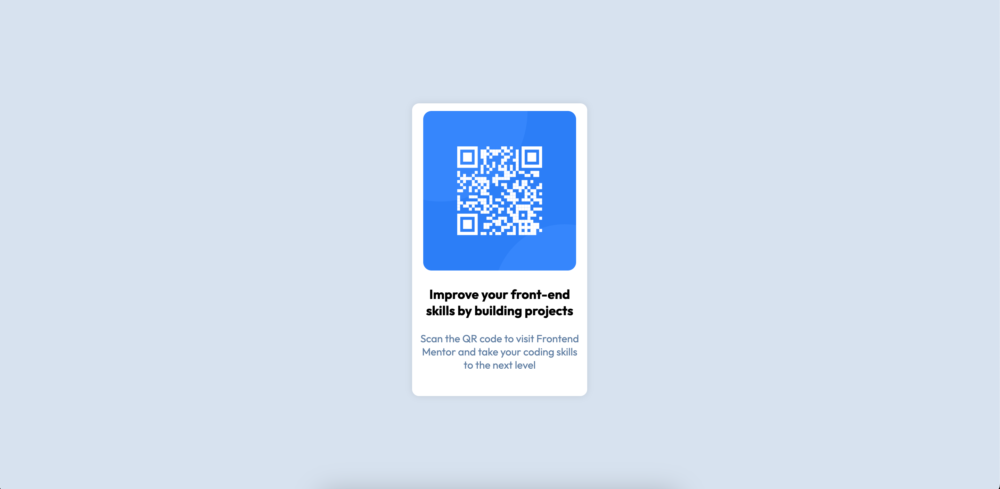

# Frontend Mentor - QR code component solution

This is a solution to the [QR code component challenge on Frontend Mentor](https://www.frontendmentor.io/challenges/qr-code-component-iux_sIO_H). Frontend Mentor challenges help you improve your coding skills by building realistic projects. 

## Table of contents

- [Overview](#overview)
  - [Screenshot](#screenshot)
  - [Links](#links)
- [My process](#my-process)
  - [Built with](#built-with)
  - [What I learned](#what-i-learned)
  - [Useful resources](#useful-resources)
- [Author](#author)

**Note: Delete this note and update the table of contents based on what sections you keep.**

## Overview

### Screenshot



### Links

- Solution URL: (https://github.com/heisemmanuell/QR-Code-component.git)
- Live Site URL: (https://heisemmanuell.github.io/QR-Code-component/)

## My process

### Built with

- Semantic HTML5 markup
- CSS 
- Flexbox

### What I learned

I learned how to add google fonts in html and css

```html
<link href="https://fonts.googleapis.com/css2?family=Outfit:wght@100..900&display=swap" rel="stylesheet">
```
```css
body{
  font-family: "Outfit", sans-serif;
}
```

### Useful resources

- [Example resource 1](https://www.youtube.com/watch?v=p1QU3kLFPdg&t=299s&ab_channel=SuperSimpleDev) - This helped me to upload a live version of the website using github. I really liked this pattern and will use it going forward.

## Author

- Frontend Mentor - [@heisemmanuell](https://www.frontendmentor.io/profile/heisemmanuell)
